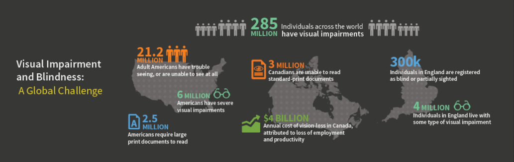
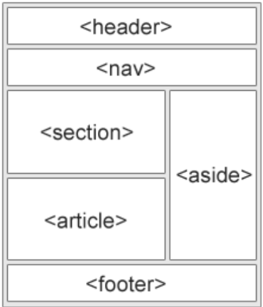

# Introduction to HTML

---

# HTML or How To Make Lasagna  

*actually it's HyperText Markup Language

---

HTML is a fairly simple language made up of elements, which can be applied to pieces of text to give them different meaning in a document.

- Heading
- Paragraph
- List
- Table
- Image
- Header
- Navigation
- Section
- Footer
 
 ---

## Anatomy of an HTML element


---

## Anatomy of an HTML element


| Property | What is it |
| -------- | ---------- |
|   `<p>`  | HTML element (tag) |
|   class  | HTML attribute |
| editor-note | Value of the class attribute |
| My cat is very grumpy | Content of `<p>` tag |

---

## Basic HTML template

This is what a basic HTML template looks like.

```html
<!DOCTYPE html>
<html>

    <head>
        <title>A Basic HTML Template</title>
    </head>

    <body>
        <!-- all content here -->
    </body>

</html>
```

---

## Choose the right tag for the job

- Tags should be chosen based on the semantic value of the content
- Tags should **NEVER** ever be chosen based on presentation, or look.

This means that these tags are basically off limits: 

`<big>` `<small>` `<i>` `<b>` `<center>` `<font>` `<hr/>` `<br/>`

---

## Choose the right tag for the job

Anytime you catch yourself thinking

"I should use `<tag>` because I need it to look like..."

# ✋ Stop! ✋

---

## Google ♥ Semantic HTML

Semantic HTML pleases Google. It is easier for it to crawl and index your site. This means

- A better ranking in search results.
- Less of a need to “game” the Google algorithm with SEO shenanigans.

---

## Semantic HTML = Accessibility

[](http://blogs.actuate.com/wp-content/uploads/2015/04/visualimpairmentstats.png)

- 22% of Canadians over the age of 15 live with at least one disability (6.2 million).
- 26% of Americans have some type of disability. (61 million).

---

## Semantic HTML = Accessibility

Policies and laws worldwide exist and will become more and more important in the future.

https://www.w3.org/WAI/policies/

### Fines of up to $250,000 😬

---

## Semantic HTML = Accessibility

### 🙏🏿 Always write good HTML 🙏🏻

---

## Choose the right tag for the job

### Block-level elements

`<h1>` `<h2>` `<h3>` `<h4>` `<h5>` `<h6>`

`<p>` `<ul>` `<ol>` `<li>` 

`<table>` `<form>` `<div>`

---

## Choose the right tag for the job

### Inline-level elements

`` `<a>` `<span>` `<button>`

`<input>` `<label>` `<select>` `<option>` 

`<textarea>`

---

## Choose the right tag for the job

### HTML 5 semantic tags

`<header>` `<footer>` `<nav>` 

`<main>` `<aside>` `<section>` 

`<article>`

---

## Choose the right tag for the job

What a semantic HTML site looks like:

